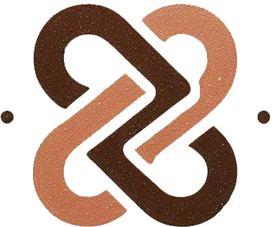

# 📖 Story Bonds

**Story Bonds** é uma plataforma web que conecta pessoas através de histórias emocionantes e inspiradoras. Este projeto foi desenvolvido como parte de um estudo na plataforma EBAC, utilizando HTML, CSS e Bootstrap para criar uma interface moderna e acessível.

## 🌟 Funcionalidades

- **🎡 Carrossel de Imagens**: Destaque de momentos emocionantes de reencontros.
- **📚 História da Semana**: Seção dedicada a histórias inspiradoras enviadas pelos usuários.
- **📝 Envie Sua História**: Formulário para usuários submeterem suas próprias histórias.
- **🔗 Redes Sociais**: Links para Instagram, YouTube, Facebook, X, Pinterest e TikTok.

## 📂 Estrutura do Projeto

```
├── index.html          # Arquivo principal HTML
├── /style
│   └── main.css        # Estilos personalizados
├── /lib
│   └── bootstrap.min.css  # Estilos do Bootstrap
│   └── bootstrap.bundle.min.js  # Scripts do Bootstrap
├── /img
│   └── logo1.png       # Logo principal
│   └── logo2.ico       # Ícone do site
│   └── CARROSSEL UM.png # Imagem do carrossel
│   └── CARROSSEL DOIS.png # Imagem do carrossel
│   └── amigos.jpg      # Imagem de história
│   └── escrevendo.jpg  # Imagem do formulário de envio
│   └── socialmedia.jpg # Imagem de redes sociais
│   └── (outros ícones de redes sociais)
└── /js
    └── main.js         # Scripts personalizados
```


## 🔗 Acesse o Projeto Online

Confira a versão online do projeto no [Vercel](https://storybonds-ebac.vercel.app/).

---

**Story Bonds** - Onde histórias conectam vidas. 🌍❤️


